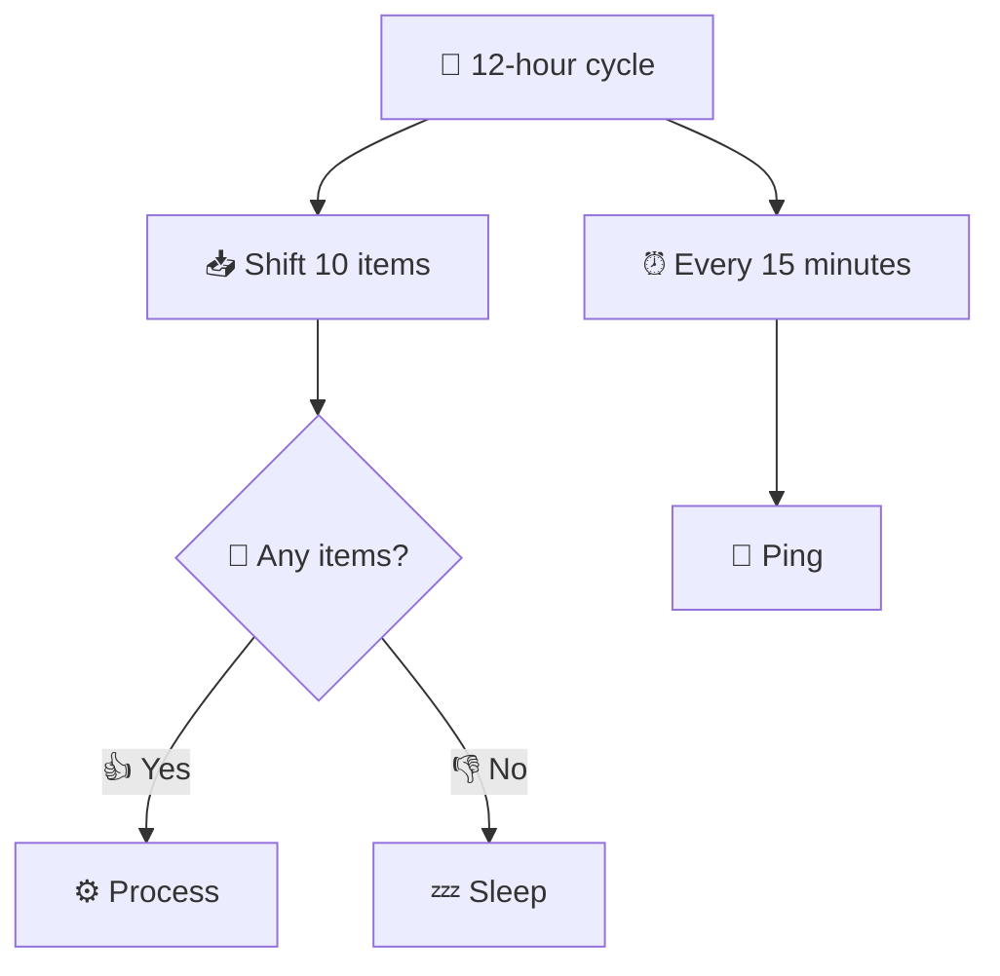

# Long polling

A workflow for monitoring the output queue and either processing messages or
sleeping if the queue is empty.

- 📥 Shift items from a queue,
- ⚙️ process them,
- or 💤 sleep briefly if the queue is empty.
- 🔁 Continue for several hours, then 🚪 exit to clean up any dangling
  resources.

```
🔁 Repeat for 12 hours:
    📥 Shift 10 items from a queue
        → 🛑 Any items received?
            → 👍 Yes → ⚙️ Process them → 🔄 Repeat
            → 👎 No → 💤 Sleep → 🔄 Repeat
⏰ Once in 15 minutes:
    📡 Ping
```


