```mermaid
flowchart TD
    Main[🔁 12-hour cycle] --> Shift[Shift 10 items]
    Shift --> Any{Any items?}
    Any --> |Yes| Process[⚙ Process]
    Any --> |No| Sleep[💤 Sleep]
    Main --> Timer["⏰ Every 15 minutes"]
    Timer --> Ping["📡 Ping"]
```

# Long polling

A workflow for polling processes:
- shift items from a queue,
- process them,
- and sleep briefly if the queue is empty.
- Continue for several hours, then exit to clean up any dangling resources.

```
Repeat for 12 hours:
    Shift 10 items from a queue
        → 0 items received?
            → Yes → Sleep → Repeat
            → No → Process them → Repeat
Once in 15 minutes:
    Ping
```


