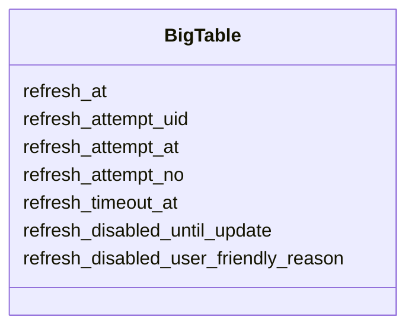

# Refresh with Retry Policy

Refreshing is simple. Just add a `refresh_at` column to indicate the time for
the next refresh, and you're done.

Retry is necessary between refreshes. If refreshes happen one after another,
there would be no need to retry.

So, retry is a mechanism that executes the refresh again before the next
planned refresh.

Sometimes a refresh should be stopped completely. For example, if the provided
`input_url` is no longer accessible. In this case, it's better to stop the
refresh, until the user updates the model, and display the corresponding
message: "Provided URL is invalid: https://example.com/broken."

**refresh_at**
- Next time to start a refresh unconditionally, either due to a retry or a
  normal refresh time (the decision has already been made, and the result is in
  the `refresh_at` field)

**refresh_attempt_uid**
- Each refresh process receives a unique token and must stop immediately if the
  token differs from the one stored in the database.

**refresh_attempt_at**
- Last time a refresh was started

**refresh_attempt_no**
- Each time a new refresh starts, this variable increases
- Each time a refresh succeeds, this variable resets to zero

**refresh_timeout_at**
- The time when the current refresh process will fail with a timeout reason.

**refresh_disabled_until_update**
- When not empty, indicates that the refresh was disabled until the next manual
  save

**refresh_disabled_user_friendly_reason**
- A reason to display to the customer, usually: "Provided URL is invalid:
  https://example.com/broken"

## Time to calculate refresh_at

1. When new refresh process starts. This time next refresh_at could be
   calculated taking into account timeout. It should start no earlier than
   current time + timeout.
2. When refresh process succeeds. In previous step (1), next refresh_at was
   calculated with timeout. But refresh process might succeed much earlier. In
   this case next refresh_at must be updated to closest possible next
   refresh_at (without timeout delay). Consider case when timeout=1hr, time to
   process is only 10 min, and refresh interval is 30 min.
3. When refresh process failed. In this case, next refresh_at should be
   calculated using refresh_attempt_no and planned refresh_at (preference
   should be taken depending on the policy).

## Edge case: Retry overlaps with refresh

Refresh should start every day at 2PM. Time limit for a refresh process is 2
hours. Due to errors and retry policy, next refresh should start at 1:30PM.
Should it be started? Or, instead, next refresh should be scheduled 30 minutes
ahead, at 2PM, and treated as retry refresh? In other words, is it important to
keep refresh aligned with original timing?

[x] Start refresh every day at specific time. Ignore retries which overlaps
with original timing.

## Edge case: Refresh overlays with refresh

Refresh configured to run every 30 minutes, but timeout is set to 1 hour.

## Implementation

This section provides a demo implementation for **refresh-retry-policy** workflow.



```php
class BigTable
{
    static public function cronjob_refresh(Carbon $end): int
    {
        $out = 0;
        while (now()->lt($end)) {
            $big_table = BigTable::cast_null(BigTable::query_refresh()->first());
            if (!$big_table) {
                break;
            }
            $big_table->start_refresh();
            $out++;
        }
        return $out;
    }

    static public function poll(Carbon $end): int
    {
        $redis = Redis::connection();

        $out = 0;
        while (now()->lt($end)) {
            list ($strings) = $redis->transaction(function (\Redis $m) {
                $queue = 'bigtables-output';
                $limit = 100;
                $m->lrange($queue, 0, $limit - 1);
                $m->ltrim($queue, $limit, -1);
            });
            if (!count($strings)) {
                break;
            }
            $items = array_map(fn ($v) => json_decode($v, true), $strings);
            $big_tables = BigTable::query()->whereIn('uid', array_pluck($items, 'big_table_uid'))->get()->keyBy('uid');
            foreach ($items as $item) {
                $big_table = $big_tables[$item['big_table_uid']];
                if ($big_table->request_attempt_uid !== $item['request_attempt_uid']) {
                    continue;
                }
                switch ($item['type']) {
                case 'success':
                    $big_table->refresh_at = ...;
                    $big_table->refresh_attempt_uid = null;
                    $big_table->refresh_attempt_at = null;
                    $big_table->refresh_attempt_no = 0;
                    $big_table->refresh_timeout_at = null;
                    break;
                case 'failure':
                    $big_table->refresh_at = ...;
                    $big_table->refresh_attempt_uid = null;
                    $big_table->refresh_attempt_at = null;
                    $big_table->refresh_timeout_at = null;
                    break;
                case 'user_friendly_status':
                    // ...
                    break;
                }
            }
            BigTable::upsert($big_tables);
        }
        return $out;
    }

    /**
     * Select all models for which the refresh process should be started
     */
    static public function query_refresh()
    {
        return BigTable::query()->where('refresh_at', '<', now())->orderBy('refresh_at');
    }

    public function start_refresh()
    {
        $this->refresh_at = ...;
        $this->refresh_timeout_at = ...;
        $this->refresh_attempt_uid = cuid();
        $this->refresh_attempt_no++;

        $redis = Redis::connection();
        $redis->rpush('bigtables-input', json_encode([
            'big_table_uid' => $this->uid,
            'refresh_attempt_uid' => $this->refresh_attempt_uid,
            'input_url' => $this->input_url,
        ]));

        $this->save();
    }
}
```
