# Refresh with Retry Policy

A workflow for refreshing models with a retry policy.

It is based on the observation that only two variables are necessary to
implement refresh with backoff retry:

- `refresh_at` — the time to start the refresh process
- `attempt_no` — the refresh attempt number, which increases with each attempt
  and resets only on successful completion.

These two variables are the bare minimum. When the refresh mechanism has
built-in timeout support, they are sufficient. However, to simplify the
explanation, one additional variable is used:

- `deadline_at` — the time when a running refresh process should be considered
  stalled and forcefully canceled.

To summarize, the following three variables will be used by this approach:

| Variable      | Description                                                                          |
|---------------|--------------------------------------------------------------------------------------|
| `refresh_at`  | The time when the next refresh should be started.                                    |
| `deadline_at` | The time when the current refresh should be cancelled due to a timeout.              |
| `attempt_no`  | Attempt number. Increases with each start and resets only when the refresh succeeds. |

And here is an overview of how this approach works:

- 🚀 start new refresh:
  - 📅 calculate refresh **deadline** time
  - 🗓 calculate **next refresh** after deadline
  - ➕ increase `attempt_no`
- ✅ success — refresh finished successfully and on time, no retry needed:
  - 🗓 calculate next refresh time
  - 🧹 reset deadline time
  - 🧹 reset `attempt_no`
- ❌ failure — refresh failed, retry should be performed:
  - 🗓 calculate next refresh time after immediately after backoff delay
  - 🧹 reset deadline time
- 💥 final_failure — several attempts were made, but all failed
  - 🧹 reset next refresh time
  - 🧹 reset deadline time

### Some common refresh and retry flows:

```mermaid
---
xdisplayMode: compact
xconfig:
  xtheme: neo-dark
---
gantt
    title start → success
    dateFormat  HH:mm
    axisFormat %H:%M

    🚀 Start: milestone, 08:00,
    ⚙️ Refresh         :a1, 08:00, 2m
    ✅ Success : milestone, 08:01, 2m
```



Usually, after the first failure, a retry is issued immediately:

```mermaid
---
xdisplayMode: compact
xconfig:
  xtheme: neo-dark
---
gantt
    title start → retry → success
    dateFormat HH:mm
    axisFormat %H:%M

    🚀 Start : milestone, m1, 08:00, 0m
    ⚙️ Refresh : a1, 08:00, 5m
    ❌ Failed : milestone, m2, 08:04, 2m
    🔄 Retry : a2, 08:05, 1m
    ✅ Success : milestone, m3, 08:05, 2m
```



The second retry, however, is usually scheduled after a short delay:


### How it can be expressed in code:

```php
refresh_retry([
    'rrule' => 'RRULE:FREQ=HOURLY;INTERVAL=2',
    'timeout' => '1 hour',
    'retries' => [
        0,
        '1 minute',
        '5 minute',
        '10 minutes',
        '15 minutes',
    ],
]);
```

```php
refresh_retry([
    'expr' => '
        - Refresh the model every 2 hours
        - Allow 1 hour for a response
        - On the first failure, retry immediately
        - On the second failure, retry after 1 minute
        - On the third failure, retry after 5 minutes
        - On the fourth failure, retry after 10 minutes
        - On the fifth failure, retry after 15 minutes
        - Panic
    ',
]);
```

```php
public function refresh_retry(string $action): void
{
    refresh_retry([
        'rrule' => $this->refresh_rrule,
        'timeout' => 'PT1H',
        'attempt_no' => $this->refresh_attempt,
        'retry_intervals' => [0, 'PT5M', 'PT10M', 'PT15M', 'PT30M', 'PT1H'],
        'action' => $action,
        'fn' => function (RefreshAttempt $attempt) use ($action) {
            Log::info(sprintf('[big_table_refresh_retry] %s | %s | %s', $action, $this->pub_id, json_encode($attempt)));
            $this->refresh_at = $attempt->refresh_at;
            $this->deadline_at = $attempt->deadline_at;
            $this->refresh_attempt = $attempt->attempt_no;
            if ($attempt->final_failure) {
                $this->is_disabled_until_update = true;
                $this->user_friendly_disabled_message = 'Something is wrong with the provided url. Please replace it and try again.';
            }
        },
    ]);
    if ($action !== REFRESH_RETRY_START) {
        $this->save();
        return;
    }
    // [...]
}
```

## Reasoning

Refreshing is simple. Just add a `refresh_at` column to indicate the time for
the next refresh, and you're done.

Retry is necessary between refreshes. If refreshes happen one after another,
there would be no need to retry.

So, retry is a mechanism that executes the refresh again before the next
planned refresh.

Sometimes a refresh should be stopped completely. For example, if the provided
`input_url` is no longer accessible. In this case, it's better to stop the
refresh, until the user updates the model, and display the corresponding
message: "Provided URL is invalid: https://example.com/broken."

**refresh_at**
- Next time to start a refresh unconditionally, either due to a retry or a
  normal refresh time (the decision has already been made, and the result is in
  the `refresh_at` field)

**refresh_attempt_uid**
- Each refresh process receives a unique token and must stop immediately if the
  token differs from the one stored in the database.

**refresh_attempt_at**
- Last time a refresh was started

**refresh_attempt_no**
- Each time a new refresh starts, this variable increases
- Each time a refresh succeeds, this variable resets to zero

**refresh_timeout_at**
- The time when the current refresh process will fail with a timeout reason.

**refresh_disabled_until_update**
- When not empty, indicates that the refresh was disabled until the next manual
  save

**refresh_disabled_user_friendly_reason**
- A reason to display to the customer, usually: "Provided URL is invalid:
  https://example.com/broken"

## When to calculate `refresh_at`

1. When new refresh process starts.
    - This time, the next `refresh_at` must be calculated by considering the
      timeout. It should start no earlier than the current time plus the
      timeout.
2. When refresh process succeeds.
    - In the previous step (1), the next `refresh_at` was calculated with the
      timeout. However, the refresh process might succeed much earlier. In this
      case, the next `refresh_at` must be updated to the closest possible next
      `refresh_at` (without the timeout delay). Consider the case when the
      timeout is 1 hour, the time to process is only 10 minutes, and the
      refresh interval is 30 minutes. In this scenario, the next `refresh_at`
      should be updated to the nearest 30-minute interval after the process
      completes, ignoring the 1-hour timeout delay.
3. When the refresh process fails.
    - In this case, the next `refresh_at` should be calculated using
      `refresh_attempt_no` and the planned `refresh_at`, with preference given
      depending on the retry policy (i.e., whether it is necessary to keep the
      refresh aligned with the original timing).

## Edge case: Retry overlaps with refresh

Refresh should start every day at 2PM. Time limit for a refresh process is 2
hours. Due to errors and retry policy, next refresh should start at 1:30PM.
Should it be started? Or, instead, next refresh should be scheduled 30 minutes
ahead, at 2PM, and treated as retry refresh? In other words, is it important to
keep refresh aligned with original timing?

[x] Start refresh every day at specific time. Ignore retries which overlaps
with original timing.

## Edge case: Refresh overlaps with the following refresh

Refresh configured to run every 30 minutes, but timeout is set to 1 hour.

## Implementation

This section provides a demo implementation for **refresh-retry-policy** workflow.


```php
class BigTable
{
    static public function cronjob_refresh(Carbon $end): int
    {
        $out = 0;
        while (now()->lt($end)) {
            $big_table = BigTable::cast_null(BigTable::query_refresh()->first());
            if (!$big_table) {
                break;
            }
            $big_table->start_refresh();
            $out++;
        }
        return $out;
    }

    static public function poll(Carbon $end): int
    {
        $redis = Redis::connection();

        $out = 0;
        while (now()->lt($end)) {
            list ($strings) = $redis->transaction(function (\Redis $m) {
                $queue = 'bigtables-output';
                $limit = 100;
                $m->lrange($queue, 0, $limit - 1);
                $m->ltrim($queue, $limit, -1);
            });
            if (!count($strings)) {
                break;
            }
            $items = array_map(fn ($v) => json_decode($v, true), $strings);
            $big_tables = BigTable::query()->whereIn('uid', array_pluck($items, 'big_table_uid'))->get()->keyBy('uid');
            foreach ($items as $item) {
                $big_table = $big_tables[$item['big_table_uid']];
                if ($big_table->request_attempt_uid !== $item['request_attempt_uid']) {
                    continue;
                }
                switch ($item['type']) {
                case 'success':
                    $big_table->refresh_retry('success');
                    break;
                case 'failure':
                    $big_table->refresh_retry('failure');
                    break;
                case 'user_friendly_status':
                    // ...
                    break;
                }
            }
            BigTable::upsert($big_tables);
        }
        return $out;
    }

    /**
     * Select all models for which the refresh process should be started
     */
    static public function query_refresh()
    {
        return BigTable::query()->where('refresh_at', '<', now())->orderBy('refresh_at');
    }

    public function start_refresh(): void
    {
        $this->refresh_retry('start');

        $redis = Redis::connection();
        $redis->rpush('bigtables-input', json_encode([
            'big_table_uid' => $this->uid,
            'refresh_attempt_uid' => $this->refresh_attempt_uid,
            'input_url' => $this->input_url,
        ]));

        $this->save();
    }

    public function refresh_retry(string $action): void
    {
        $anchor = now()->startOfDay()->format('Ymd\THis\Z');
        $rrule = \RRule\RRule::createFromRfcString("DTSTART:$anchor\nRRULE:FREQ=HOURLY;INTERVAL=2");
        $timeout = new DateInterval('PT2H');
        $retry_delay = [null, 'PT0M', 'PT1M', 'PT5M', 'PT15M', 'PT30M', 'PT1H'];

        switch ($action) {
        case 'start':
            $this->refresh_attempt_uid = cuid();
            $this->refresh_attempt_no++;
            $this->refresh_attempt_started_at = now();
            $this->refresh_attempt_timeout_at = now()->add($timeout);
            $this->refresh_at = $rrule->getNthOccurrenceAfter($this->refresh_timeout_at, 1);
            break;
        case 'success':
            $this->refresh_attempt_uid = null;
            $this->refresh_attempt_no = 0;
            $this->refresh_attempt_started_at = null;
            $this->refresh_timeout_timeout_at = null;
            $this->refresh_at = $rrule->getNthOccurrenceAfter(now(), 1);
            break;
        case 'failure':
            $this->refresh_attempt_uid = null;
            $this->refresh_attempt_started_at = null;
            $this->refresh_timeout_timeout_at = null;
            if (count($retry_delay) < $this->refresh_attempt_no) {
                // Several attempts were made, but all failed
                $this->refresh_at = null;
                $this->refresh_disabled_until_update = true;
                $this->refresh_disabled_user_friendly_reason = sprintf('Cannot refresh BigTable after %d attempt(s)', $this->refresh_attempt_no);
                break;
            }
            // Schedule a retry
            $delay = new DateInterval($retry_delay[$this->refresh_attempt_no]);
            $retry_start_at = now()->add($delay);
            $retry_timeout_at = $retry_start_at->copy()->add($timeout);
            $planned_refresh_at = $rrule->getNthOccurrenceAfter(now(), 1);
            if (!$planned_refresh_at) {
                // No more planned refreshes are expected.
                // Start the retry after the specified delay.
                $this->refresh_at = $retry_start_at;
                break;
            }
            // Keep the refresh aligned with the original timing
            if ($retry_start_at->gt($planned_refresh_at)) {
                // Retry starts after the next planned refresh.
                // Wait less than necessary and start the retry at the next planned refresh.
                $this->refresh_at = $planned_refresh_at;
                break;
            }
            if ($retry_timeout_at->gt($planned_refresh_at)) {
                // Retry starts before the planned refresh but might end after it.
                // Wait a bit longer and start the retry at the next planned refresh.
                $this->refresh_at = $planned_refresh_at;
                break;
            }
            // Retry starts before and is expected to finish before the next planned refresh.
            // Start the retry after the specified delay.
            $this->refresh_at = $retry_start_at;
            break;
        default:
            throw new Error("Invalid action: $action");
        }
    }
}
```

## Real-World Scenarios • Create a thumbnail of a banner after editing

A banner was edited. Immediately after it is saved, a request to the thumbnailer
service should be made to create a fresh thumbnail. However, this request might
fail. If, after several attempts, the thumbnails still cannot be created, mark
the banner with "thumbnail creation failed".

1. Send a request to the thumbnailer service.
2. Allow 1 minute to complete.
3. On the first failure, retry immediately.
4. On the second failure, retry after 1 minute.
5. On the third failure, retry after 5 minutes.
6. On the fourth failure, mark the banner with "thumbnail creation failed."

## Real-World Scenarios • Refresh BigTable twice per day at 6 AM and 4 PM

1. Refresh BigTable twice per day at 6 AM and 4 PM
2. Allow 1 hour to complete
3. On the first failure, retry immediately.
4. On the second failure, retry after 1 minute.
5. On the third failure, retry after 5 minutes.
6. On the fourth failure, retry after 15 minutes.
7. On the fifth failure, retry after 30 minutes.
8. On the sixth failure, retry after 1 hour.
9. On the seventh failure
   - Disable auto-refresh
   - Send the customer an email that BigTable refresh was disabled
