## High level overview of Refresh/Retry workflow

```mermaid
---
config:
  layout: elk
  theme: neo-dark
---
flowchart TD

    subgraph s1["⚡ Trigger Events"]
        ManualStart["👨‍💻 Manual Start"]
        ScheduleStart["⏰ Scheduled Start"]
        Retry["🔄 Retry"]
    end

    Start["🚀 Start"]
    Success["✅ Success"]
    Failure["❌ Failure"]
    FinalFailure["💥 Final Failure"]

    ManualStart --> Start
    ScheduleStart --> Start
    Failure --> Retry2["🔄 Retry"]
    Retry --> Start
    Start --> Success
    Start --> Failure --> FinalFailure
```



## Simple refresh/retry policy

```mermaid
---
config:
  layout: elk
  theme: neo-dark
---

classDiagram
    direction LR

    class Start["🚀 Start"] {
        ⏰ calculate deadline_at
        🗓 calculate refresh_at immediately after deadline
        ➕ increase attempt_no
    }

    class Success["✅ Success"] {
        🗓 calculate refresh_at time
        🧹⏰ reset deadline_at
        🧹➕ reset attempt_no
    }

    class Failure["❌ Failure"] {
        🗓 calculate refresh_at immediately after backoff delay
        🧹⏰ reset deadline_at time
    }

    class FinalFailure["💥 Final Failure"] {
        🧹🗓 reset refresh_at time
        🧹⏰ reset deadline_at time
    }

    Start --> Success
    Start --> Failure
    Start --> FinalFailure
```



## Scheduled refresh


## Scheduled refresh with retries

```mermaid
---
xdisplayMode: compact
---
gantt
    title Scheduled refresh with retries
    dateFormat HH:mm
    axisFormat %H:%M

    ⚙️ Refresh: 08:00, 30m

    ❌ Failure: milestone, 08:10, 1m
    🔄 Retry: 08:10, 30m

    ❌ Failure: milestone, 08:20, 1m
    🔄 Retry: 08:20, 30m

    ⚙️ Refresh: 09:00, 30m
    ⚙️ Refresh: 10:00, 30m
    ⚙️ Refresh: 11:00, 30m
```



## start → success

```mermaid
---
xdisplayMode: compact
xconfig:
  xtheme: neo-dark
---
gantt
    title start → success
    dateFormat HH:mm
    axisFormat %H:%M

    🚀 Start    : milestone, 08:00, 0m
    ⚙️ Refresh  :            08:00, 2m
    ✅ Success   : milestone, 08:01, 2m
```



## start → retry → success

Usually, after the first failure, a retry is issued immediately:

```mermaid
---
xdisplayMode: compact
xconfig:
  xtheme: neo-dark
---
gantt
    title start → retry → success
    dateFormat HH:mm
    axisFormat %H:%M

    🚀 Start    : milestone, 08:00, 0m
    ⚙️ Refresh  :            08:00, 5m
    ❌ Failure   : milestone, 08:04, 2m
    🔄 Retry    :            08:05, 1m
    ✅ Success   : milestone, 08:05, 2m
```



## start → retry → retry → success

The second retry, however, is usually scheduled after a short delay:


## Edge case: Retry overlaps with refresh


Refresh should start every day at 2PM. Time limit for a refresh process is 2
hours. Due to errors and retry policy, next refresh should start at 1:30PM.
Should it be started? Or, instead, next refresh should be scheduled 30 minutes
ahead, at 2PM, and treated as retry refresh? In other words, is it important to
keep refresh aligned with the original timing?

There could be an option in the UI:

✅ Start refresh every day at a specific time (ignore retries that overlap
with the original timing)

## Edge case: Refresh overlaps with each other

```mermaid
gantt
    title Edge case: Refresh overlaps with each other
    dateFormat HH:mm
    axisFormat %H:%M

    ⚙️ Refresh: 08:00, 1h
    ⚙️ Refresh: 08:30, 1h
    ⚙️ Refresh: 09:00, 1h
    ⚙️ Refresh: 09:30, 1h
    ⚙️ Refresh: 10:00, 1h
    ⚙️ Refresh: 10:30, 1h
    ⚙️ Refresh: 11:00, 1h
    ⚙️ Refresh: 11:30, 1h
```



Refresh is configured to run every 30 minutes, but the timeout is set to 1 hour.

## Edge case: Retries without final_failure

Retries should be performed, but they shouldn't result in `final_failure`.
After the final retry, `attempt_no` will be reset, and a new regular refresh
should be scheduled.

```mermaid
gantt
    title Edge case: Retries without final_failure
    dateFormat HH:mm
    axisFormat %H:%M

    ⚙️ Refresh  :            08:00, 15m
    ❌ Failure 1 : milestone, 08:15
    🔄 Retry 1  :            08:15, 15m
    ❌ Failure 2 : milestone, 08:30
    🔄 Retry 2  :            08:30, 15m
    ❌ Failure 3 : milestone, 08:45

    ⚙️ Refresh  :            09:00, 15m
    ❌ Failure 1 : milestone, 09:15
    🔄 Retry 1  :            09:15, 15m
    ❌ Failure 2 : milestone, 09:30
    🔄 Retry 2  :            09:30, 15m
    ❌ Failure 3 : milestone, 09:45

    ⚙️ Refresh  :            10:00, 15m
```



## 5 cases of refresh and planned intervals

```text
1. retry before planned (before)

    rrrrr
            ppppp

2. retry overlaps start of planned (overlaps_start)

        rrrrr
            ppppp

3. retry same as planned (overlaps_fully)

            rrrrr
            ppppp

4. retry overlaps end of planned (overlaps_end)

                rrrrr
            ppppp

5. retry after planned (after)

                    rrrrr
            ppppp
```

```mermaid
---
displayMode: compact
---
gantt
    title 3. retry same as planned (overlaps_fully)
    dateFormat HH:mm
    axisFormat %H:%M

    🚦: milestone, 08:15, 0m
    🏁: milestone, 10:15, 0m
    🔄 Retry: 09:00, 30m
    ⚙️ Planned: 09:00, 30m
```

```mermaid
---
displayMode: compact
---
gantt
    title 5. retry after planned (after)
    dateFormat HH:mm
    axisFormat %H:%M

    🚦: milestone, 08:15, 0m
    🏁: milestone, 10:15, 0m
    🔄 Retry: 09:35, 30m
    ⚙️ Planned: 09:00, 30m
```






